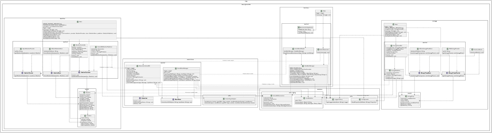

# Photovoltaic Analyser

## Descripción del Proyecto

El Photovoltaic Analyser es un sistema integral diseñado para analizar y optimizar la producción de energía fotovoltaica. El sistema recopila, procesa y analiza datos de energía y condiciones meteorológicas para proporcionar insights valiosos sobre la eficiencia y rentabilidad de instalaciones fotovoltaicas.

### Propuesta de Valor

- **Análisis en Tiempo Real**: Monitoreo continuo de precios de energía y condiciones meteorológicas.
- **Optimización de Costes**: Identificación de patrones de precios para maximizar el retorno de inversión.
- **Integración con Power BI**: Visualización avanzada de datos para toma de decisiones.
- **Arquitectura Modular**: Sistema escalable y mantenible con componentes independientes.

## Justificación de Diseño

### Selección de APIs

1. **REE (Red Eléctrica Española) API**
   - Proporciona datos oficiales y actualizados sobre precios de energía en España
   - Ofrece información detallada por hora y mercado (diario, intradiario)
   - Permite acceso gratuito con límites de peticiones adecuados para nuestras necesidades
   - Formato JSON estandarizado que facilita la integración

2. **OpenWeather API**
   - Cobertura global con datos precisos para múltiples ubicaciones
   - Actualizaciones frecuentes que permiten correlación con precios de energía
   - API bien documentada con múltiples parámetros meteorológicos relevantes
   - Buen rendimiento y fiabilidad con plan gratuito suficiente para desarrollo

### Estructura del DataMart

El DataMart está organizado en dos conjuntos de datos principales:

1. **Datos de Energía Consolidados**
   - Dimensión temporal: fecha/hora en formato estandarizado
   - Medidas: precio por kWh, volumen negociado, mercado
   - Granularidad: Horaria para permitir análisis detallados
   - Formato: CSV optimizado para integración con Power BI

2. **Datos Meteorológicos Consolidados**
   - Dimensión temporal: fecha/hora en formato estandarizado
   - Dimensión espacial: ubicación (nombre, coordenadas)
   - Medidas: temperatura, humedad, velocidad del viento, descripción
   - Granularidad: Múltiples lecturas diarias por ubicación
   - Formato: CSV con estructura de fácil consulta

Esta estructura permite:
- Correlacionar datos meteorológicos con precios de energía
- Realizar análisis temporales y geográficos
- Generar modelos predictivos basados en condiciones históricas
- Optimizar visualizaciones en Power BI con mínima transformación

## Arquitectura del Sistema

El sistema está diseñado con una arquitectura modular orientada a eventos que consta de cuatro componentes principales:

1. **Energy Feeder**: Recopila datos de precios de energía de la API de REE.
2. **Weather Feeder**: Obtiene datos meteorológicos de múltiples ubicaciones usando OpenWeather API.
3. **Event Store Builder**: Centraliza y almacena eventos generados por los feeders.
4. **Business Unit**: Procesa los datos almacenados para análisis y visualización en Power BI.

<div align="center">
  
  <p><em>Diagrama de Clases del Sistema</em></p>
</div>

## Arquitectura de la Aplicación

### Patrón MVC

El sistema implementa el patrón Modelo-Vista-Controlador (MVC) en cada módulo:

1. **Modelo (Model)**
   - Clases de dominio (EnergyPrice, Weather, Location)
   - Interfaces de persistencia (EnergyPricesStore, WeatherStore)
   - Implementaciones de almacenamiento (SQLiteEnergyPriceStore, SQLiteWeatherStore)

2. **Vista (View)**
   - Interfaz con Power BI para visualización
   - Generación de reportes CSV
   - Logs y monitoreo del sistema

3. **Controlador (Controller)**
   - EnergyController: Gestiona el flujo de datos de energía
   - WeatherController: Coordina la obtención de datos meteorológicos
   - EventStoreManager: Administra el almacenamiento de eventos
   - DataMartManager: Procesa y consolida datos

### Interfaces de Módulos

Cada módulo expone interfaces claras para su integración:

1. **Energy Module**
   - EnergyPricesProvider: Obtención de datos
   - EnergyPricesStore: Persistencia
   - EnergyPublisher: Publicación de eventos

2. **Weather Module**
   - WeatherProvider: Obtención de datos
   - WeatherStore: Persistencia
   - WeatherPublisher: Publicación de eventos

3. **Event Store Module**
   - EventStore: Almacenamiento de eventos
   - Subscriber: Suscripción a eventos

4. **Business Module**
   - DataMartManager: Gestión de datamarts
   - EventStoreReader: Lectura de eventos

## Flujo de Datos

El flujo de datos a través del sistema sigue este patrón:

1. **Recolección**:
   - Energy Feeder obtiene precios de energía de REE API
   - Weather Feeder obtiene datos meteorológicos de OpenWeather API

2. **Almacenamiento Local**:
   - Datos se guardan en bases de datos SQLite para persistencia local
   - Se publican eventos a través de ActiveMQ

3. **Centralización**:
   - Event Store recibe eventos y los organiza por tipo y fecha
   - Eventos se almacenan en un sistema de archivos estructurado

4. **Procesamiento**:
   - Business Unit lee eventos históricos y recibe eventos en tiempo real
   - Se generan datamarts consolidados en formato CSV

5. **Visualización**:
   - Power BI se conecta a los datamarts para análisis visual
   - Se generan informes y dashboards interactivos

## Instrucciones de Instalación y Ejecución

### Prerrequisitos

- Java 21
- Maven 3.8+
- ActiveMQ 5.16+
- SQLite 3
- API Key de OpenWeather (para Weather Feeder)
- Power BI Desktop (para visualización)

### Ejecución

1. **Energy Feeder** 

Ejecutando con Intellij con los argumentos: 

* database.bd sql (en caso de querer usar sql)
* database.bd activemq (en caso de querer usar activemq)

```bash
# O usando el JAR compilado:
java -jar energy-feeder.jar photovoltaic-data.db activemq

# 0 
java -jar energy-feeder.jar photovoltaic-data.db sql
```

2. **Weather Feeder**

Ejecutando con Intellij con los argumentos:

* apikey database.bd sql (en caso de querer usar sql)
* apikey database.bd activemq (en caso de querer usar activemq)

```bash
# O usando el JAR compilado:
java -jar weather-feeder.jar OPENWEATHER_API_KEY photovoltaic-data.db activemq

# 0
java -jar weather-feeder.jar OPENWEATHER_API_KEY photovoltaic-data.db sql
```

3. **Event Store Builder**

Ejecutando con Intellij sin argumentos

```bash
# O usando el JAR compilado:
java -jar event-store-builder.jar
```

4. **Business Unit**

Ejecutando con Intellij sin argumentos
```bash
# O usando el JAR compilado:
java -jar business-unit.jar
```

### Verificación

Para verificar que el sistema está funcionando correctamente:

```bash
# Verificar eventos almacenados
ls -la ./events

# Verificar datamarts generados
ls -la ./datamart
```

## Ejemplos de Uso

### Consulta de Precios de Energía

```java
// Obtener precios de energía actuales
EnergyPricesProvider provider = new REEEnergyProvider();
List<EnergyPrice> prices = provider.getEnergyPrices();

// Guardar precios en SQLite
EnergyPricesStore store = new SQLiteEnergyPriceStore("energy.db");
store.storeEnergyPrices(prices);

// Publicar precios como eventos
EnergyPublisher publisher = new EnergyPublisher();
publisher.start();
for (EnergyPrice price : prices) {
    publisher.publish(new Gson().toJson(price));
}
```

### Obtención de Datos Meteorológicos

```java
// Definir ubicaciones a monitorear
List<Location> locations = Arrays.asList(
    new Location("Madrid", 40.4168, -3.7038),
    new Location("Barcelona", 41.3851, 2.1734),
    new Location("Valencia", 39.4699, -0.3763)
);

// Obtener datos meteorológicos para cada ubicación
WeatherProvider provider = new OpenWeatherProvider("YOUR_API_KEY");
for (Location location : locations) {
    Weather weather = provider.getWeatherData(location);
    System.out.println(location.getName() + ": " +
                      weather.getTemperature() + "°C, " +
                      weather.getDescription());
}
```

### Consultas a los Datamarts (SQL)

```sql
-- Precios promedio diarios
SELECT
    substr(timestamp, 1, 10) as date,
    avg(price) as avg_price
FROM
    consolidated_energy
GROUP BY
    date
ORDER BY
    date DESC
LIMIT 7;

-- Ubicaciones más cálidas
SELECT
    location,
    avg(temperature) as avg_temp
FROM
    consolidated_weather
WHERE
    timestamp >= date('now', '-7 days')
GROUP BY
    location
ORDER BY
    avg_temp DESC;

-- Correlación clima-precio
SELECT
    w.date,
    w.location,
    w.temperature,
    e.price
FROM
    (SELECT substr(timestamp, 1, 10) as date, location, avg(temperature) as temperature
     FROM consolidated_weather GROUP BY date, location) w
JOIN
    (SELECT substr(timestamp, 1, 10) as date, avg(price) as price
     FROM consolidated_energy GROUP BY date) e
ON
    w.date = e.date
WHERE
    w.location = 'Madrid'
ORDER BY
    w.date DESC
LIMIT 14;
```

### Integración con Power BI

1. Abrir Power BI Desktop
2. Seleccionar "Obtener datos" > "Texto/CSV"
3. Navegar a la carpeta `./datamart` y seleccionar los archivos consolidados
4. Crear relaciones entre tablas basadas en el campo fecha/hora
5. Crear visualizaciones:
   - Gráfico de líneas para precios de energía a lo largo del tiempo
   - Mapa de calor de temperaturas por ubicación
   - Gráfico de dispersión para correlación entre temperatura y precio

## Arquitectura de Procesamiento de Datos

El sistema implementa una arquitectura Lambda, que combina procesamiento en tiempo real y por lotes:

### Capa de Velocidad (Speed Layer)
- Procesamiento en tiempo real de eventos
- Actualización inmediata de datamarts
- Uso de ActiveMQ para streaming de eventos
- Implementado en:
  - Energy Feeder: Publicación inmediata de precios
  - Weather Feeder: Actualización en tiempo real de condiciones meteorológicas
  - Event Store: Procesamiento de eventos en streaming

### Capa de Lote (Batch Layer)
- Procesamiento de datos históricos
- Generación de datamarts consolidados
- Implementado en:
  - Event Store: Almacenamiento persistente de eventos
  - Business Unit: Procesamiento por lotes para análisis histórico

### Capa de Servicio (Serving Layer)
- Integración con Power BI
- Visualización de datos procesados
- Implementado en:
  - Business Unit: Generación de datamarts
  - Power BI: Dashboard y análisis

### Ventajas de la Arquitectura Lambda
- Procesamiento en tiempo real para decisiones inmediatas
- Análisis histórico para tendencias y patrones
- Tolerancia a fallos y recuperación de datos
- Escalabilidad horizontal

## Contribuciones
Alberto Rivero Monzón https://github.com/albertuti1910

Adrián Ojeda Viera https://github.com/adriaanojeda